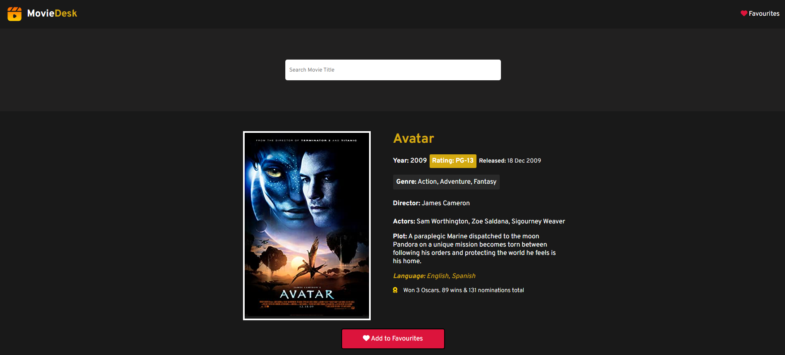
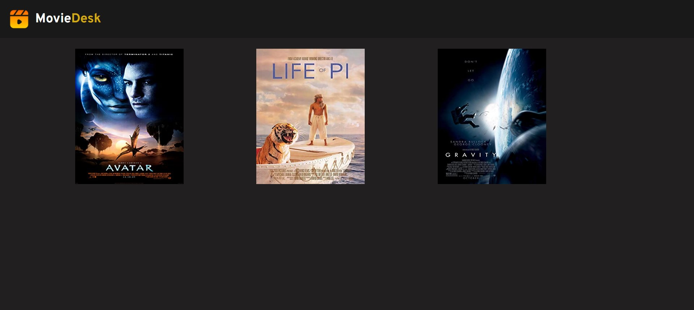

# IMDB-Clone-App

This is a Movie info app made using OMDB API. When users enters the movie title in search box, they will get suggestions and when they click on a movie they will get full info about that movie. Users can also add their favourite movies in the favourites list and view their list by clicking on the favourites button in nav bar.

# TECHSTACK
HTML, CSS, JavaScript
